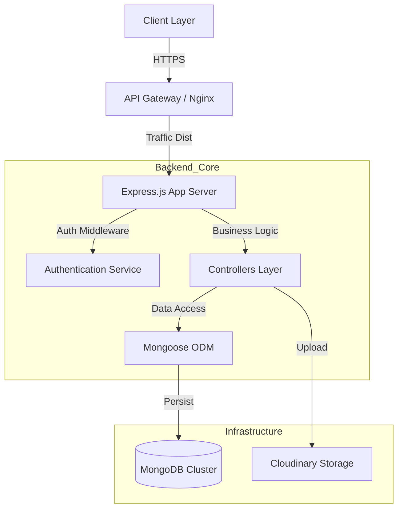
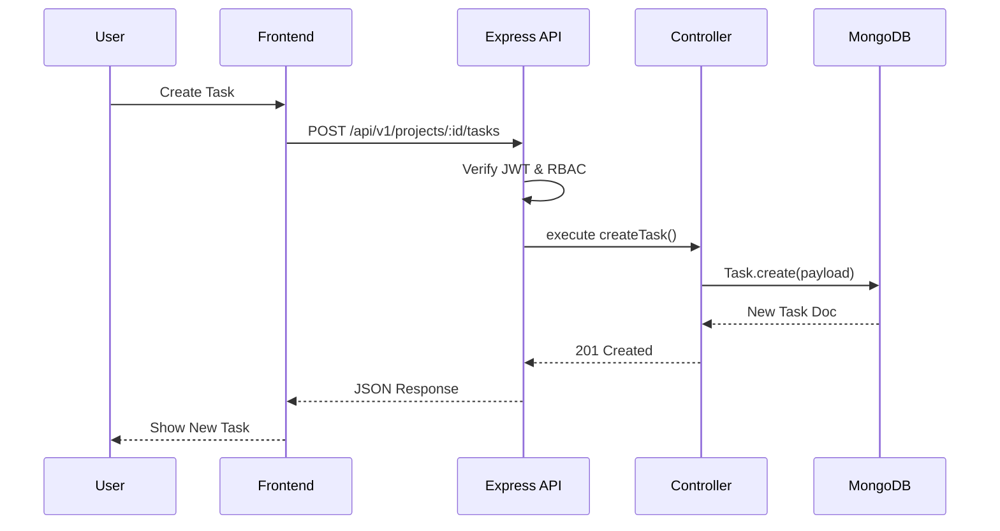
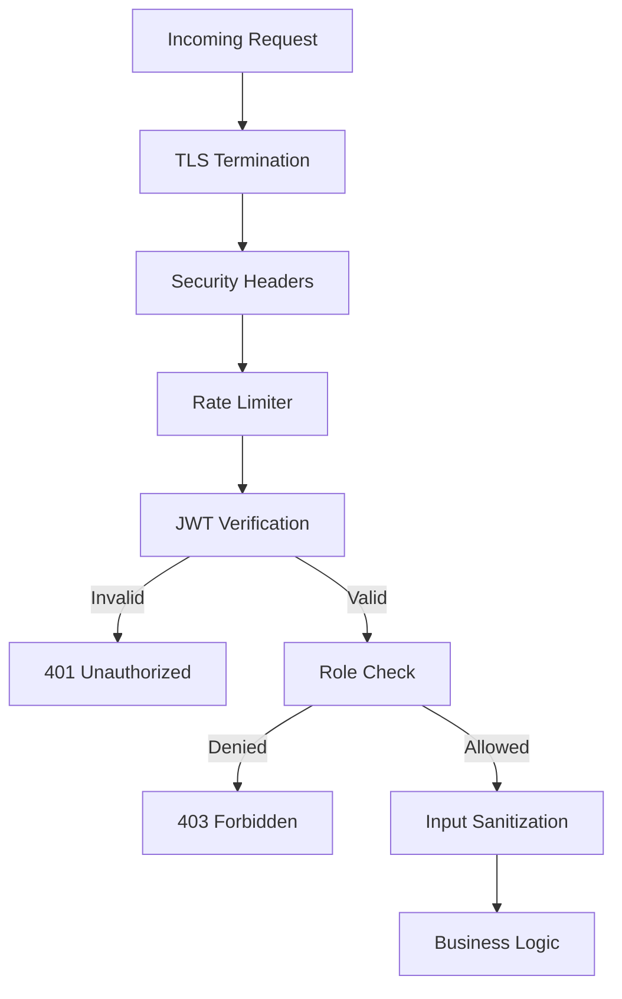

# Project Flow : Project Management System

## 1. Project Overview

### System Description
The **Project Planning & Management System (PMS)** is a production-grade, full-stack collaborative platform designed to streamline project execution, task tracking, and team communication. It provides a centralized environment for managing project lifecycles, from initiation to closure, ensuring data integrity and role-based security.

### Core Problem Solved
Enterprises face challenges in maintaining visibility over distributed teams and multifaceted projects. PMS resolves this by optimizing:
- **Task Granularity**: Hierarchical breakdown of work into projects, tasks, and subtasks.
- **Access Control**: Strict governance of data access through Role-Based Access Control (RBAC).
- **Documentation**: Integrated note-taking and document management to reduce context switching.
- **Real-time Synchronization**: Instant updates on task status and project milestones.

### Target Users
- **Super Administrators**: Executive oversight, system-wide configuration, and tenant management.
- **Project Administrators**: Managers responsible for project delivery, team composition, and resource allocation.
- **Team Members**: Individual contributors tracking tasks, updating progress, and collaborating on deliverables.

### System Goals
- **Scalability**: Architecture designed to handle horizontal scaling via stateless authentication.
- **Reliability**: Fault-tolerant API design with centralized error handling and atomic transactions.
- **Security**: Defense-in-depth approach utilizing JWT, secure HTTP-only cookies, and rigorous input validation.

---

## 2. System Architecture

### High-Level Architecture

The system follows a **Layered Monolithic Architecture** (evolving towards potential microservices). It separates concerns into clear presentation, business logic, and data persistence layers.

#### Architecture Diagram

**ASCII:**
```ascii
[Clients]              [Security Layer]           [App Layer]            [Data Layer]
   │                          │                        │                      │
   ├──HTTPS──┐                │                        │                      │
   ▼         │                │                        │                      │
[Frontend]   │          ┌─────▼──────┐           ┌─────▼──────┐         ┌─────▼─────┐
(React SPA)  │          │ Rate Limit │           │ Controller │         │  MongoDB  │
   │         │          └─────┬──────┘           └─────┬──────┘         └─────┬─────┘
   │         │                │                        │                      │
   │         ├───REST────►[Auth Guard] ──next()──► [Services] ◄──ORM───► [Cloudinary]
   │         │          (JWT Verify)             (Business)               (Storage)
   ▼         │                │                        │                      │
[Mobile App] │                ▼                        ▼                      │
(Future)     │          [RBAC Check]             [Utils/HLPs]                 │
             │                                                                │
             └────────────────────────────────────────────────────────────────┘
```

**Mermaid:**


### Component Diagram

**ASCII:**
```ascii
   ┌──────────────────────────────────────────────────────────────┐
   │                       EXPRESS APP                            │
   │  ┌──────────────┐   ┌──────────────┐   ┌──────────────┐      │
   │  │  Middlewares │   │  Controllers │   │    Models    │      │
   │  │ (Auth, RBAC) │──►│(Task, Proj.) │──►│ (Schema def) │      │
   │  └──────┬───────┘   └──────┬───────┘   └──────┬───────┘      │
   └─────────┼──────────────────┼──────────────────┼──────────────┘
             ▼                  ▼                  ▼
      [JWT Service]      [Email Service]     [DB Service]
```

### Communication Patterns
- **Protocol**: RESTful API over HTTPS.
- **Payload**: JSON for data, Multipart for files.
- **State**: Stateless API; Session via JWT.

---

## 3. Technology Stack

| Layer | Technology | Version | Purpose |
| :--- | :--- | :--- | :--- |
| **Frontend** | React.js | v18+ | Component-based UI Architecture |
| | Vite | Latest | High-performance Build Tooling |
| | TailwindCSS | v4.0 | Utility-first Styling Engine |
| | Axios | Latest | Promise-based HTTP Client |
| **Backend** | Node.js | v20+ | Asynchronous Event-Driven Runtime |
| | Express.js | v5 | Web Application Framework |
| **Database** | MongoDB | v7.0 | NoSQL Document Store (Multi-model) |
| | Mongoose | Latest | Object Data Modeling (ODM) |
| **Auth** | JWT (JsonWebToken) | Standard | Stateless Authentication |
| | Bcrypt.js | Latest | Adaptive Key Derivation (Hashing) |
| **Infrastructure** | Cloudinary | API v2 | Digital Asset Management |

---

## 4. Database Design

### Schema Architecture

#### Entity Relationship Diagram (ERD)

**ASCII:**
```ascii
[User] 1 ◄── reference ── N [ProjectMember] N ── belong ──► 1 [Project]
  ▲                                                            ▲
  └────────── 1 ◄── createdBy ── N [ProjectNote] ──────────────┘
                                       │
  ┌────────────────────────────────────┼────────────────────────────────────┐
  ▼                                    ▼                                    ▼
[Task] N ◄── inside ── 1 [Project]    [Doc] N ◄── inside ── 1 [Project]   [Notif]
  │
  └── 1 ── has ──► N [SubTask]
```


### Data Integrity
- **Constraints**: Unique indexes on `User.email`, `User.username`, `Project.name`.
- **Validation**: Enum validation for `Task.status` (todo, in_progress, done) and `ProjectMember.role`.
- **Relationships**: Mongoose `ref` for referential integrity simulation.

---

## 5. User Roles & Functionalities

### Role: Super Administrator
- **Permissions**: Root access.
- **Features**: Manage all users, view system stats, create/delete any project.
- **Restricted**: None.

### Role: Project Administrator
- **Permissions**: Full control over specific projects.
- **Features**: Manage members, create tasks, upload documents, edit project notes.
- **Restricted**: Cannot access other projects, cannot elevate to Super Admin.

### Role: Member
- **Permissions**: Contributor access.
- **Features**: View project details, update assigned tasks, toggle subtasks (to complete), create notes.
- **Restricted Actions**:
  - **Cannot revert task status from 'Done'** (Strict Restriction).
  - **Cannot revert completed subtasks** (Strict Restriction).
  - Cannot delete tasks/documents.
  - Cannot manage team composition.

---

## 6. API Design

### Request Flow (Sequence Diagram)

**ASCII:**
```ascii
 User        FE         API        Auth       Ctrl        DB
  │           │          │          │          │          │
  ├──action──►│          │          │          │          │
  │           ├──Req────►│          │          │          │
  │           │          ├──Verify─►│          │          │
  │           │          │◄──User───┘          │          │
  │           │          ├──Route─────────────►│          │
  │           │          │                     ├──Query──►│
  │           │          │                     │◄──Data───┘
  │           │          │◄──────Response──────┘          │
  │           │◄──JSON───┘                                │
  │◄──Update──┘                                           │
```

**Mermaid:**


### Key Endpoints
| Endpoint | Method |Auth | Description |
| :--- | :--- | :--- | :--- |
| `/auth/login` | POST | Public | Authenticate user |
| `/projects/:id` | GET | Member+ | Get project details |
| `/projects/:id/tasks` | POST | ProjAdmin+ | Create task |
| `/tasks/:id` | PUT | Member+ | Update task (Role Restricted) |
| `/admin/users` | GET | SuperAdmin | List all system users |

---

## 7. Security Architecture

### Security Flow Diagram

**ASCII:**
```ascii
[Request] ──► [Helmet Headers] ──► [CORS] ──► [Rate Limit]
                                                   │
         ┌─────────────────────────────────────────┘
         ▼
[JWT Middleware]
    │── Valid? ──► [RBAC Middleware] ──► [Controller]
    │                    │ Access?           │
    ▼                    ▼                   ▼
 [401 Unauth]       [403 Forbidden]     [Sanitization]
```

**Mermaid:**


### Core Defenses
- **Authentication**: Dual-token system (Access + Refresh).
- **Authorization**: Granular RBAC middleware checking ProjectMember collection.
- **Input Integrity**: `express-validator` to prevent Injection.
- **Encryption**: Bcrypt for passwords; TLS 1.2+ for transport.

---

## 8. System Development Methodology

- **Lifecycle**: Agile.
- **Git Strategy**: Feature branching (`feat/`, `fix/`).
- **Review**: Pull Requests requiring approval.
- **Testing**: Integration testing for API routes.

---

## 9. Formal Methods / System Reliability

### Validation Strategy
The system enforces strict schema validation at the database level using Mongoose Schemas (Type checking, Enums, Required fields) and at the application layer using `express-validator` chains.

### Fault Tolerance & Recovery
- **Error Handling**: Centralized `AsyncHandler` wrapper catches all asynchronous errors, forwarding them to a global error handling middleware that standardizes JSON error responses.
- **Database**: Recommended Replica Set configuration for MongoDB ensures high availability and automatic failover.
- **Atomic Operations**: Critical state changes use Mongoose atomic operators (`$set`, `$push`) to maintain consistency.

---

## 10. Folder Structure

```
project-root/
 ├── backend/
 │   ├── src/
 │   │   ├── controllers/   # Business Logic
 │   │   ├── middlewares/   # Auth, Error, Multer
 │   │   ├── models/        # Data Schemas
 │   │   ├── routes/        # API Routing
 │   │   ├── utils/         # Helpers
 │   │   ├── db/            # DB Connection
 │   │   └── app.js         # Entry Point
 ├── frontend/
 │   ├── src/
 │   │   ├── api/           # API Services
 │   │   ├── components/    # Reusable UI
 │   │   ├── context/       # State Management
 │   │   ├── pages/         # Views
 │   │   └── main.jsx
 └── README.md
```

---

## 13. Future Enhancements

- **Microservices Migration**: Decoupling Auth and Notification services.
- **Advanced Scalability**: Database sharding for high-volume data.
- **Security Upgrades**: Multi-Factor Authentication (MFA) and OAuth2 integration.
- **Feature Expansion**: Gantt Charts, Time Tracking, and Slack Integration.

---

## 14. Conclusion

The **Project Planning & Management System** is engineered for production readiness, stability, and security. By strictly adhering to separation of concerns, implementing rigorous validation, and enforcing secure access controls, it provides a trustworthy platform for enterprise project management. The architecture supports future scaling and feature evolution without compromising core reliability.
